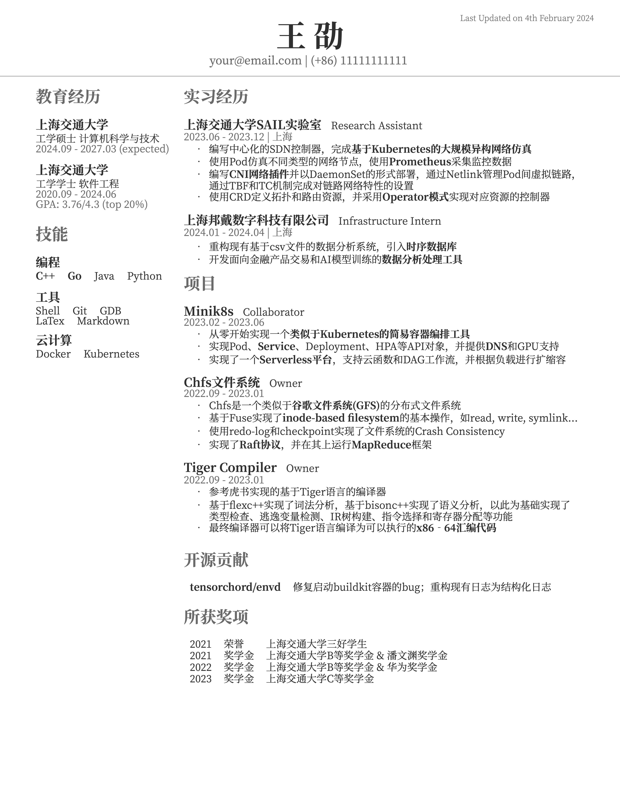

# My-Job-Hunting

这个Repo用来记录我找工作/实习的过程和一点经验分享，会随着我找工作的进度不定期更新...

## 大三暑假

由于预计大四保研后会比较的闲，我在暑期投了一些校招和日常实习的岗位。投递的重心在日常实习，投校招是为了~~免费面试刷经验~~学习。在这个过程中我饱受各个大厂面试官/HR的摧残，收拒信收到麻木，时常被自己菜到怀疑人生...

在接受了一个月的面试洗礼后，我明显感觉到自己的算法能力、对八股的熟悉程度都有了很大的提升（好歹刷LeetCode的时候不用查cppreference了🤡），对着自己简历吹水的能力也有了很大的进步😇。最后我拿到了Intel BigDL组的日常实习offer，不过由于种种原因最后还是拒绝掉了，算是为这段痛苦的经历画上了一个相对来讲还算过得去的句号。

下面浅浅记录一下...

| 企业   | 岗位                 | 面试流程                                         | 结果     |
| ------ | -------------------- | ------------------------------------------------ | -------- |
| 字节   | 系统工程实习生      | [三轮技术面](./interview/ByteDance.md)           | Reject😭  |
| 九坤   | Kubernetes开发实习生 | [一轮笔试](./interview/Ubiquant.md)(等待后续...) | Waiting🤔️ |
| 天王星 | C++软件开发工程师   | [HR面](./interview/Uranus.md)                    | Reject😭  |
| Intel  | BigDL-LLM组实习生    | [两轮技术面](./interview/Intel.md)               | Offer😋   |

## 大四寒假

终于圆了一直以来的心愿，这个寒假开始实习啦！

| 企业   | 岗位                 | 面试流程                                         | 结果     |
| ------ | -------------------- | ------------------------------------------------ | -------- |
| RisingWave | 数据库内核开发实习生 | [一轮技术面](./interview/RisingWave.md)        | Reject😭  |
| BondiTech | 基础架构实习生 | - - - | Offer😋 |

## 简历

我用的是由@gaocegege维护的[Deedy-Resume-for-Chinese](https://github.com/dyweb/Deedy-Resume-for-Chinese) latex模版，中英文版本都有，我的[中文版简历](./resume/resume.pdf)如下：

    

感谢你院硬核的课程，让我好歹能在简历上放几个比较solid的项目。面试官一般都会追着你简历上的项目问，并根据你的项目延伸出来一些八股，所以需要对自己做过的项目非常的熟悉。

我把我项目的复习资料放在了[project文件夹](./project/)下，大家可以参考这种形式去准备自己的项目。

## 算法

我刷题是三天打鱼两天晒网类型的，集中在面试前突击。到目前为止我刷了快200道LeetCode题，虽然比不上那些动辄800+的大佬，但是感觉面试已经差不多够用了（要是面试官非得出不常见的难题，那只好自认倒霉了😇）。

Leetcode特别推荐几个题集：

1. [剑指offer](https://leetcode.cn/studyplan/coding-interviews/)（相当的经典，强烈推荐）
2. [LeetCode 热题 100](https://leetcode.cn/studyplan/top-100-liked/)（经常会考到）
3. [代码随想录](https://programmercarl.com)（题量大、题解很详细，推荐跟着做一遍，尤其是DP）

除了Leetcode之外，特别推荐一些刷题网站：
1. [CodeTop企业题库](https://codetop.cc/home)（里面有各个大厂的招聘题，可以看到考察频率）
2. [HackerRank](https://www.hackerrank.com)（外企面试必备，可以拿来熟悉一下面试环境）

## 八股

我基本是实战学习...🤡

我整理了一些[C++八股](./c++/)和[system八股](./system/)，有兴趣可以看一下。

## 学习资料

1. [cppreference](https://zh.cppreference.com/w/首页) （不用多说，学习常见的STL用法看官方文档效率最高）
2. [hello算法](https://www.hello-algo.com) （krahets大神的数据结构教程，通俗易懂）
3. [牛客网](https://www.nowcoder.com) （各种面经，还有各种焦虑...）
4. 计算机网络推荐Stanford的CS144，质量很高，讲得很清楚
5. [CS-Notes面试笔记](https://cyc2018.xyz)（技术面试必备基础知识、Leetcode、计算机操作系统、计算机网络、系统设计）
6. [CS自学指南](https://csdiy.wiki)（真正学过一遍理解通透了，八股才能记得更牢）

## 其它说明

如果有什么好的建议或者是发现了一些错误的地方，欢迎提issue；如果内容有侵权的地方，请随时联系我删除

本仓库下的所有内容遵循[MIT 3.0 License](./LICENSE)开源协议
